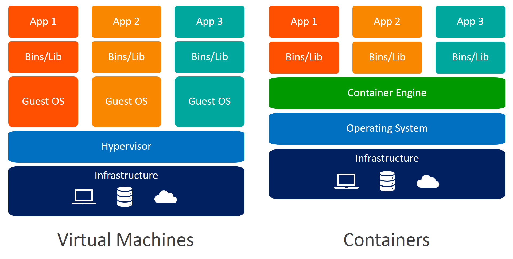
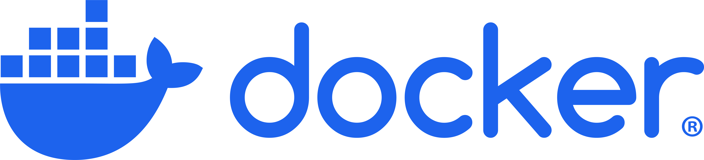

## About Me {.smaller}

- Senior at the University of Connecticut 🎓

- Pursuing a Dual Degree in Statistical Data Science and Mechanical Engineering 🔢⚙️

- Second year leading a workshop at CSAS.

# Outline {.smaller}

1. Why? (5 mins)
2. Containerization vs Virtual Machines (5 mins)
3. Docker (20 mins)
4. Example 1: Visualizing Basketball data with Docker (15 mins)
5. Deploying Apps with Docker (5 mins)
5. Example 2: ML Pipeline (15 mins)
6. Further Reading and Wrap up (5 mins)


# Why?


## The Problem {.smaller}
 
#### Producing reproducable code often has challenges:
- Different OS environments
- Dependency conflicts  
- Version mismatches


#### Especially issues in:
- Data science  
- Research
- Team projects  


## Solution 

- Create a completely independant environment develop and deploy program.

- Removes os / version related dependancies

Two ways to implement this:

<center>
**Containerization** and **Virtualization**
</center>


## Containers vs VMs {.smaller}

::: columns 

::: column 

#### Vitrual Machines

- Full **guest OS** per instance  
- Heavier (GBs)  
- Slower startup  
- Strong isolation  

**Stack:**

:::: {style="font-size: 90%;"}

<center>
Hardware  
↓  
Host OS  
↓  
**Hypervisor**     
↓  
**Guest OS  **   
↓  
App  
</center>

::::


:::

::: column


#### Containers

- Share **host OS kernel**  
- Lightweight (MBs)  
- Fast startup  
- Process-level isolation  

**Stack:**

:::: {style="font-size: 90%;"}

<center>
Hardware  
↓  
Host OS  
↓  
**Docker**      
↓  
**Container   **     
↓  
App  
</center>

::::

:::

:::


## When to Use{.smaller}

::: columns

::: column
#### Virtual Machines

- Running **different OS environments**
- Strong **security & isolation**
- **Legacy / monolithic systems**
- OS-level testing and control  

**Examples:**

- Systems requiring strict isolation (e.g., banking systems)
- Testing software on **multiple OS versions** (Windows 10 vs 11)
- Secure environments where workloads must be fully separated  

:::

::: column
#### Containers

- **Fast development & deployment**
- Microservices architecture  
- Reproducibility  
- Scalable cloud applications  

**Examples:**

- Running **Jupyter notebooks with fixed dependencies** 
- Packaging a **ML model** for deployment  
- Spinning up dev environments instantly for team members  

:::

:::


## Key Takeaway {.smaller}

- **VMs** → full machines, heavy, secure, OS-level control  
- **Containers** → lightweight, fast, ideal for modern apps  
 

- Use containers for speed, portability, and development workflows
- Use VMs for strong isolation and different OS needs

{width='140%' fig-align="center"}


::: {style="font-size: 60%;"}
Source: @bmc_containers_vms
:::


## Popular Container Platforms {.smaller}

- **Docker** – Build and run containers  
- **Kubernetes** – Orchestrate and scale containers  
- **Podman** – Secure, daemonless container engine  
- **OpenShift** – Enterprise Kubernetes platform  
- **Amazon ECS** – AWS container service  
- **Singularity (Apptainer)** – Popular in HPC and research environments 

::: {style="font-size: 60%;"}
Source: @top10_container_platforms
:::

## Popular Virtual Machine Platforms {.smaller}

- **VMware** – Industry-leading virtualization platform  
- **VirtualBox** – Free, open-source VM software  
- **Microsoft Hyper-V** – Built into Windows  
- **KVM** – Linux-based virtualization (Kernel Virtual Machine)  
- **Amazon EC2** – Cloud-based virtual machines on AWS  

::: {style="font-size: 60%;"}
Source: @best_vm_software
:::


# 
:::: {columns}
::: {.column style="font-size: 250%;" }

**Docker**
:::
::: {.column width="50%" .center}
{width='80%' fig-align="center"}
:::
::::


## What is Docker {.smaller}

- Platform for **developing, shipping, and running applications** 
- First in 2013
- Uses **containers** instead of virtual machines  
- Packages:
  - Application code  
  - Runtime  
  - Libraries & dependencies  
- Ensures **consistency across environments** (dev → test → production)

::: {style="font-size: 60%;"}
Source: @docker_software_wikipedia
:::

## Deploying Applications with Docker {.smaller}

- **Bundle everything:** code, dependencies, runtime, configs  
- **Run anywhere:** consistent across systems  
- **Push to registry:** Docker Hub or private registry  
- **Scale easily:** single or multiple containers, works with Kubernetes/Swarm  
- **Use cases:** web apps, APIs, databases, ML models  


## Docker Engine {.smaller}


- Core runtime that **builds and runs containers**  
- Responsibilities:
  - Build images  
  - Run containers  
  - Manage networks & volumes 
  - **Available on Linux only.**


## Docker Desktop {.smaller}

- User-friendly application for **Windows & macOS**  
- Includes:
  - Docker Engine  
  - GUI dashboard  
  - Kubernetes (optional)  
- Handles:
  - Linux VM setup on Mac/Windows need for Docker Engine
  - Networking & file sharing  


## Steps to Build a Docker Container {.smaller}

1. **Prepare Your Application Code**  
   - Organize your code (Python, Node.js, etc.)  
   - Include any dependencies file (`requirements.txt`, `package.json`, etc.)

2. **Write a Dockerfile**  
    - Setup file that defines the container

3. **Build the Docker Image in Terminal**  
    - Docker Image - standardized package that includes all of the files, binaries, libraries, and configurations to run a container.

4. **Start Container from Image in Terminal**


## Dockerfile {.smaller}

- A **script** that defines how to build a Docker image  
- Contains step-by-step instructions 
- Define base image: `FROM python:3.10`  
   - Set working directory: `WORKDIR /app`  
   - Copy your code into the image: `COPY . .`  
   - Install dependencies: `RUN pip install -r requirements.txt`  
   - Set default command: `CMD ["python", "app.py"]`

### Example:
```dockerfile
FROM python:3.10
WORKDIR /app
COPY . .
RUN pip install -r requirements.txt
CMD ["python", "app.py"]
```

## Dockerfile Commands {.smaller}

**Commonly Used Commands:**

- `FROM` – base image for your container (`FROM python:3.10`)  
- `WORKDIR` – set working directory (`WORKDIR /app`)  
- `COPY` – copy files/folders into image (`COPY . .`)  
- `RUN` – execute commands during build (`RUN pip install -r requirements.txt`)  
- `CMD` – default command when container starts (`CMD ["python","app.py"]`)  
- `EXPOSE` – declare network ports (`EXPOSE 80`)  
- `ENV` – set environment variables (`ENV PORT=8080`)  


## Dockerfile Commands {.smaller}

**Less Common / Advanced Commands:**

- `ADD` – like COPY but can download/extract archives (`ADD file.tar.gz /app/`)  
- `ENTRYPOINT` – fixed startup command (`ENTRYPOINT ["python"]`)  
- `VOLUME` – mount point for persistent/shared data (`VOLUME ["/data"]`)  
- `USER` – switch to non-root user (`USER appuser`)  
- `LABEL` – add metadata (`LABEL maintainer="you@example.com"`)  
- `ARG` – build-time variable (`ARG VERSION=1.0`)  
- `HEALTHCHECK` – container health monitoring (`HEALTHCHECK CMD curl --fail http://localhost:80 || exit 1`)


## Building and Running Container {.smaller}

Once files are ready, open terminal/CMD in folder or navigate to folder with files.

1. **Build the Docker Image in Terminal**  

```bash
    docker build -t my-app-image .
```

 - `build` - builds container image from `Dockerfile`

 - `-t` - tags or names the container

 - `.` - looks for the `Dockerfile` in the current folder and copies all files.

2. **Start Container from Image in Terminal**
    
```bash
    docker run -p 5000:5000 my-app-image
```

 - `run` - Start the container from the image 

 - `-p 5000:5000` - Port mapping from `<host-port> : <container-port>`

Output: `localhost:<host-port>` or `http://127.0.0.1:*container-port*/`

Example: http://localhost:5000 or http://127.0.0.1:5000 (Prefered)


## Docker Commands {.smaller}

**Commonly Used Commands:**

- `docker build -t <image_name> .` – build an image from a Dockerfile  
- `docker run -p <host>:<container> <image>` – run a container with port mapping
- `docker run --name <container_name> <image_name>` - name and run a container
- `docker ps` – list running containers  
- `docker ps -a` – list all containers (running & stopped)  
- `docker stop <container_id>` – stop a running container  
- `docker rm <container_id>` – remove a container  
- `docker images` – list images  
- `docker rmi <image_name>` – remove an image  


## Docker Commands {.smaller}

**Less Common / Advanced Commands:**

- `docker exec -it <container_id> bash` – open a shell in a running container  
- `docker logs <container_id>` – view container logs  
- `docker inspect <container_id>` – detailed info about a container or image  
- `docker network ls` – list Docker networks  
- `docker volume ls` – list Docker volumes  
- `docker system prune` – remove unused containers, images, and networks  
- `docker-compose up` – start multi-container apps (if using Docker Compose)  
- `docker-compose down` – stop and remove multi-container apps  

## .dockerignore File {.smaller}

- Excludes files/folders from being sent to the Docker build context  
- Improves **build speed** and reduces **image size**  
- Prevents copying unnecessary or sensitive files  

**Common Examples:**
- `.git/`  
- `node_modules/`  
- `__pycache__/`  
- `*.log`  
- `.env`  

**Example:**
```txt
node_modules/
*.log
.env
```

# Example 1 

Visualizing Basketball data with Docker


## Example 1 {.smaller}

Create a baseball shot chart in a container. 
```{python}
#| fig-align: center
#| echo: false
from nba_api.stats.endpoints import shotchartdetail
from matplotlib.patches import Circle, Rectangle, Arc
import matplotlib.pyplot as plt


lebron_data = shotchartdetail.ShotChartDetail(
    team_id=0,
    player_id=2544,
    season_type_all_star="Regular Season",
    season_nullable="2023-24",
    context_measure_simple='FGA',
    timeout=100,  # increase timeout
    headers={
        'Host': 'stats.nba.com',
        'User-Agent': 'Mozilla/5.0 (Windows NT 10.0; Win64; x64)',
        'Accept': 'application/json, text/plain, */*',
        'Referer': 'https://www.nba.com/',
        'Origin': 'https://www.nba.com'
    }
).get_data_frames()[0]

fig, ax = plt.subplots(figsize=(7.5,7.5))


def draw_court(ax=None, color='black', lw=2, outer_lines=False):

    if ax is None:
        ax = plt.gca()

    hoop = Circle((0, 0), radius=7.5, linewidth=lw, color=color, fill=False)

    backboard = Rectangle((-30, -7.5), 60, -1, linewidth=lw, color=color)

    outer_box = Rectangle((-80, -47.5), 160, 190, linewidth=lw, color=color,fill=False)
    
    inner_box = Rectangle((-60, -47.5), 120, 190, linewidth=lw, color=color,fill=False)

    # Create free throw top arc
    top_free_throw = Arc((0, 142.5), 120, 120, theta1=0, theta2=180,
                         linewidth=lw, color=color, fill=False)
    # Create free throw bottom arc
    bottom_free_throw = Arc((0, 142.5), 120, 120, theta1=180, theta2=0,
                            linewidth=lw, color=color, linestyle='dashed')
    # Restricted Zone, it is an arc with 4ft radius from center of the hoop
    restricted = Arc((0, 0), 80, 80, theta1=0, theta2=180, linewidth=lw,
                     color=color)

    # Three point line
    # Create the side 3pt lines, they are 14ft long before they begin to arc
    corner_three_a = Rectangle((-220, -47.5), 0, 140, linewidth=lw,color=color)
    corner_three_b = Rectangle((220, -47.5), 0, 140, linewidth=lw, color=color)
    
    three_arc = Arc((0, 0), 475, 475, theta1=22, theta2=158, linewidth=lw,color=color)

    center_outer_arc = Arc((0, 422.5), 120, 120, theta1=180, theta2=0,linewidth=lw, color=color)
    center_inner_arc = Arc((0, 422.5), 40, 40, theta1=180, theta2=0,linewidth=lw, color=color)
    court_elements = [hoop, backboard, outer_box, inner_box, top_free_throw,
                      bottom_free_throw, restricted, corner_three_a,
                      corner_three_b, three_arc, center_outer_arc,
                      center_inner_arc]

    if outer_lines:
        outer_lines = Rectangle((-250, -47.5), 500, 470, linewidth=lw,color=color, fill=False)
        court_elements.append(outer_lines)

    for element in court_elements:
        ax.add_patch(element)

    return ax

draw_court(ax)

grouped = lebron_data.groupby(['EVENT_TYPE'])
made = grouped.get_group(('Made Shot',))
miss = grouped.get_group(('Missed Shot',))
ax.scatter(miss['LOC_X'],miss['LOC_Y'],label='Miss',marker='x',color='tab:orange',s=30)
ax.scatter(made['LOC_X'],made['LOC_Y'],label='Made',color='none',edgecolor='tab:blue',linewidths=1,s=30)
plt.ylim(422.5, -47.5)
plt.xlim(-250,250)
plt.title('Lebron James Shot Chart - 2023-24 Season')
ax.xaxis.set_tick_params(labelbottom=False)
ax.yaxis.set_tick_params(labelleft=False)

ax.set_xticks([])
ax.set_yticks([])
plt.legend()
plt.show()
```


## Step 1: Prepare Your Files {.smaller}

- Python script (e.g., `app.py`)
- Requirements file (`requirements.txt`)
- Dockerfile


All files are available on the github repo for this workshop: 

<center>
[https://github.com/ram200010/CSAS_2026_Docker/example_1](https://github.com/ram200010/CSAS_2026_Docker/example_1)

**Example 1 Folder**
</center>

## app.py {.smaller .scrollable}

```python
from flask import Flask, jsonify, send_file
from nba_api.stats.endpoints import shotchartdetail
from matplotlib.patches import Circle, Rectangle, Arc
import matplotlib.pyplot as plt


def draw_court(ax=None, color='black', lw=2, outer_lines=False):

    if ax is None:
        ax = plt.gca()

    hoop = Circle((0, 0), radius=7.5, linewidth=lw, color=color, fill=False)

    backboard = Rectangle((-30, -7.5), 60, -1, linewidth=lw, color=color)

    outer_box = Rectangle((-80, -47.5), 160, 190, linewidth=lw, color=color,fill=False)
    
    inner_box = Rectangle((-60, -47.5), 120, 190, linewidth=lw, color=color,fill=False)

    # Create free throw top arc
    top_free_throw = Arc((0, 142.5), 120, 120, theta1=0, theta2=180,
                        linewidth=lw, color=color, fill=False)
    # Create free throw bottom arc
    bottom_free_throw = Arc((0, 142.5), 120, 120, theta1=180, theta2=0,
                            linewidth=lw, color=color, linestyle='dashed')
    # Restricted Zone, it is an arc with 4ft radius from center of the hoop
    restricted = Arc((0, 0), 80, 80, theta1=0, theta2=180, linewidth=lw,
                    color=color)

    # Three point line
    # Create the side 3pt lines, they are 14ft long before they begin to arc
    corner_three_a = Rectangle((-220, -47.5), 0, 140, linewidth=lw,color=color)
    corner_three_b = Rectangle((220, -47.5), 0, 140, linewidth=lw, color=color)
    
    three_arc = Arc((0, 0), 475, 475, theta1=22, theta2=158, linewidth=lw,color=color)

    center_outer_arc = Arc((0, 422.5), 120, 120, theta1=180, theta2=0,linewidth=lw, color=color)
    center_inner_arc = Arc((0, 422.5), 40, 40, theta1=180, theta2=0,linewidth=lw, color=color)
    court_elements = [hoop, backboard, outer_box, inner_box, top_free_throw,
                    bottom_free_throw, restricted, corner_three_a,
                    corner_three_b, three_arc, center_outer_arc,
                    center_inner_arc]

    if outer_lines:
        outer_lines = Rectangle((-250, -47.5), 500, 470, linewidth=lw,color=color, fill=False)
        court_elements.append(outer_lines)

    for element in court_elements:
        ax.add_patch(element)

    return ax

app = Flask(__name__)


@app.route("/")
def get_player():
    lebron_data = shotchartdetail.ShotChartDetail(
    team_id=0,
    player_id=2544,
    season_type_all_star="Regular Season",
    season_nullable="2023-24",
    context_measure_simple='FGA',
    timeout=200,  # increase timeout
    headers = {
    'Host': 'stats.nba.com',
    'User-Agent': 'Mozilla/5.0 (Windows NT 10.0; Win64; x64)',
    'Accept': 'application/json, text/plain, */*',
    'Accept-Language': 'en-US,en;q=0.9',
    'Accept-Encoding': 'gzip, deflate, br',
    'Referer': 'https://www.nba.com/',
    'Origin': 'https://www.nba.com',
    'Connection': 'keep-alive'}).get_data_frames()[0]

    fig, ax = plt.subplots(figsize=(7.5,7.5))

    draw_court(ax)

    grouped = lebron_data.groupby(['EVENT_TYPE'])
    made = grouped.get_group(('Made Shot',))
    miss = grouped.get_group(('Missed Shot',))
    ax.scatter(miss['LOC_X'],miss['LOC_Y'],label='Miss',marker='x',color='tab:orange',s=30)
    ax.scatter(made['LOC_X'],made['LOC_Y'],label='Made',color='none',edgecolor='tab:blue',linewidths=1,s=30)
    plt.ylim(422.5, -47.5)
    plt.xlim(-250,250)
    plt.title('Lebron James Shot Chart - 2023-24 Season')
    ax.xaxis.set_tick_params(labelbottom=False)
    ax.yaxis.set_tick_params(labelleft=False)

    ax.set_xticks([])
    ax.set_yticks([])
    plt.savefig('output.png',dpi=300)
    return send_file("output.png", mimetype='image/png')


app.run(host="0.0.0.0", port=5000)
```

::: {style="font-size: 60%;"}
(Source: @tjortjoglou_nba_shot_charts) 
:::

## requirments.txt

File that lists the required packages/dependencies. 

```bash
nba_api
matplotlib
flask
```

If you want to specify package versions:

```bash
nba_api==1.4.1
matplotlib==3.8.0
flask==3.0.0
```

## Dockerfile

```{DOCKERFile}
FROM python:3.11

WORKDIR /app

COPY . .

RUN pip install -r requirements.txt

EXPOSE 5000

CMD ["python", "app.py"]
```


## Build and Run Container {.smaller}

1. Build container

```bash
docker build -t lebron-shot .
```


2. Run Container
```bash
docker run -p 5000:5000 lebron-shot
```

Output can be accessed at http://localhost:5000 or http://127.0.0.1:5000


# Deploying Apps with Docker


## Deploying Apps with Docker {.smaller}

- Share your app with others  
- Run on different machines easily  
- Deploy to cloud or production  

**Key Idea:**  
Build once → run anywhere

Anyone can access your program through **Docker Hub** once published

## Deploying Apps with Docker {.smaller}

Once the container image is built:


1. Tag your container
```bash
docker tag my-app username/my-app:latest
```


2. Login to Docker Hub

```bash
docker login
```


3. Push the image

```bash
docker push username/my-app:latest
```

## Example Deployed {.smaller}

Simple NBA Player Shot Chart Maker - Web App

Availabe at `ram20010/shot-chart`


Can be run through Docker Hub in Docker Desktop.

<center>
or 
</center> 

Can be run directly by running the following.

General Format:
```bash
docker run -p host-port:container-port username/app-name
```

This Example:
```bash
docker run -p 5000:5000 ram20010/shot-chart
```

# Example 2
ML model in a Container

## Example 2

Run Random Forest Classifier model to predict a miss or a shot in a container.

User can input player name and season to predict shots for.

Model will be trained on data from five previous seasons.


## Prepare Files {.smaller}

- `main.py` - Gets User Input and executes commands
- `get_data.py` - Contains Function to get train and test datasets
- `model.py` - Runs models and returns classification metrics
- `requirements.txt`
- `Dockerfile`

All files are available on the github repo for this workshop: 

<center>
[https://github.com/ram200010/CSAS_2026_Docker/example_2](https://github.com/ram200010/CSAS_2026_Docker/example_2)

**Example 2 Folder**
</center>


## main.py {.smaller}

```python

from nba_api.stats.static import players
from get_data import get_data
from model import train_rf_shot_model


player_name = input('Enter NBA Player Name: ')
player_season = input('Enter Season to be Predicted: ')

player_info = players.find_players_by_full_name(player_name)
player_id = player_info[0]['id']
player_name = player_info[0]['full_name']

print('Gathering data for ',player_name)

train_data, test_data = get_data(player_id,player_season)

print(train_data.head())

print('Training Random Forest Model')

train_rf_shot_model(train_data,test_data)
```


## get_data.py {.smaller}

```python
from nba_api.stats.endpoints import shotchartdetail
import pandas as pd

def get_data(player_id,target_season):

    features = ["PERIOD", "MINUTES_REMAINING","SECONDS_REMAINING","ACTION_TYPE",
    "SHOT_TYPE","SHOT_ZONE_BASIC","SHOT_ZONE_AREA","SHOT_ZONE_RANGE","SHOT_DISTANCE",
    "LOC_X", "LOC_Y", "HTM", "VTM", "TEAM_NAME","SHOT_MADE_FLAG"]

    end_year = int(target_season[:4]) 

    seasons = [f"{y}-{str(y+1)[-2:]}" for y in range(end_year - 5, end_year)]

    all_data = []

    for season in seasons:

        print(f"Fetching {season}...")

        df = shotchartdetail.ShotChartDetail(
                    team_id=0,
                    player_id=player_id,
                    season_type_all_star="Regular Season",
                    season_nullable=season,
                    context_measure_simple='FGA',
                    timeout=200, 
                    headers = {
                    'Host': 'stats.nba.com',
                    'User-Agent': 'Mozilla/5.0 (Windows NT 10.0; Win64; x64)',
                    'Accept': 'application/json, text/plain, */*',
                    'Accept-Language': 'en-US,en;q=0.9',
                    'Accept-Encoding': 'gzip, deflate, br',
                    'Referer': 'https://www.nba.com/',
                    'Origin': 'https://www.nba.com',
                    'Connection': 'keep-alive'}).get_data_frames()[0]


        df = df[features]
        df["SEASON"] = season
        all_data.append(df)

    train_data = pd.concat(all_data, ignore_index=True)

    print(f"Fetching {target_season}...")

    test_data = shotchartdetail.ShotChartDetail(
                    team_id=0,
                    player_id=player_id,
                    season_type_all_star="Regular Season",
                    season_nullable=target_season,
                    context_measure_simple='FGA',
                    timeout=200, 
                    headers = {
                    'Host': 'stats.nba.com',
                    'User-Agent': 'Mozilla/5.0 (Windows NT 10.0; Win64; x64)',
                    'Accept': 'application/json, text/plain, */*',
                    'Accept-Language': 'en-US,en;q=0.9',
                    'Accept-Encoding': 'gzip, deflate, br',
                    'Referer': 'https://www.nba.com/',
                    'Origin': 'https://www.nba.com',
                    'Connection': 'keep-alive'}).get_data_frames()[0]
    
    return train_data, test_data

```


## model.py {.smaller}


```python
from sklearn.ensemble import RandomForestClassifier
from sklearn.metrics import accuracy_score, precision_score, recall_score, f1_score
from sklearn.preprocessing import OneHotEncoder
from sklearn.compose import ColumnTransformer
from sklearn.pipeline import Pipeline

def train_rf_shot_model(train_df,test_df):
    
    features = [
        "PERIOD",
        "MINUTES_REMAINING",
        "SECONDS_REMAINING",
        "ACTION_TYPE",
        "SHOT_TYPE",
        "SHOT_ZONE_BASIC",
        "SHOT_ZONE_AREA",
        "SHOT_ZONE_RANGE",
        "SHOT_DISTANCE",
        "LOC_X",
        "LOC_Y",
        "HTM",
        "VTM",
        "TEAM_NAME"]

    X_train = train_df[features]
    y_train = train_df["SHOT_MADE_FLAG"]

    X_test = test_df[features]
    y_test = test_df["SHOT_MADE_FLAG"]


    categorical_features = [
        "ACTION_TYPE",
        "SHOT_TYPE",
        "SHOT_ZONE_BASIC",
        "SHOT_ZONE_AREA",
        "SHOT_ZONE_RANGE",
        "HTM",
        "VTM",
        "TEAM_NAME"
    ]

    numeric_features = [
        "PERIOD",
        "MINUTES_REMAINING",
        "SECONDS_REMAINING",
        "SHOT_DISTANCE",
        "LOC_X",
        "LOC_Y"
    ]

    # Preprocessing
    preprocessor = ColumnTransformer(
        transformers=[
            ("cat", OneHotEncoder(handle_unknown="ignore"), categorical_features),
            ("num", "passthrough", numeric_features)
        ]
    )

    # Model
    rf = RandomForestClassifier(
        n_estimators=300,
        random_state=42,
        n_jobs=-1
    )

    pipeline = Pipeline([
        ("preprocess", preprocessor),
        ("model", rf)
    ])

    # Train
    pipeline.fit(X_train, y_train)

    # Predict
    y_pred = pipeline.predict(X_test)

    # Metrics
    metrics = {
        "accuracy": accuracy_score(y_test, y_pred),
        "precision": precision_score(y_test, y_pred, zero_division=0),
        "recall": recall_score(y_test, y_pred, zero_division=0),
        "f1_score": f1_score(y_test, y_pred, zero_division=0)
    }

    print("Model Performance:")
    for k, v in metrics.items():
        print(f"{k}: {v:.3f}")

```

## requirements.txt

```bash
nba_api
pandas
scikit-learn
```

## Dockerfile

```bash
FROM python:3.11

WORKDIR /app

COPY . .

RUN pip install -r requirements.txt

CMD ["python", "main.py"]
```


## Build and Run Interactive Container {.smaller}

1. Build container

```bash
docker build -t shot-predict .
```


2. Run Container
```bash
docker run -it shot-predict
```


## Further Reading 

- [Docker: Get Started - Docker Docs](https://docs.docker.com/get-started/)
- [Docker Tutorial](https://docker-curriculum.com/)
- [What is Docker? - Geeks for Geeks](https://www.geeksforgeeks.org/devops/introduction-to-docker/)

# Questions?
Thank you!


## References

::: {#refs}

:::


